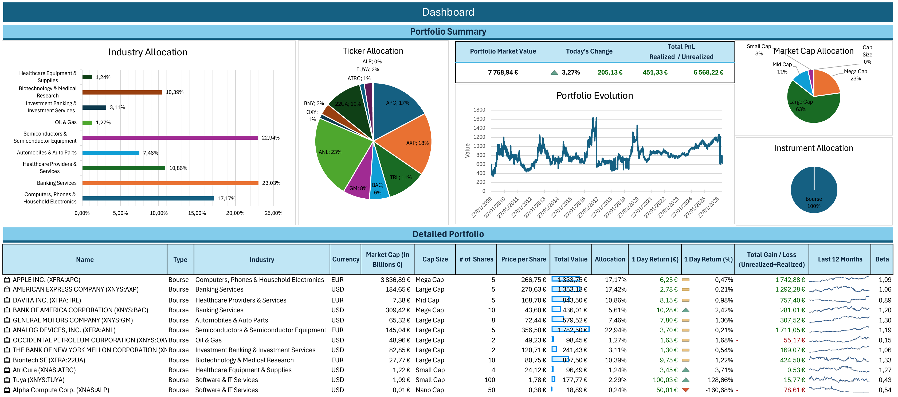
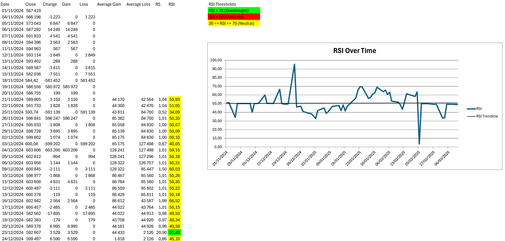
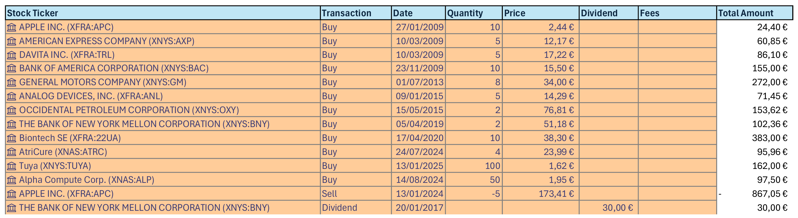
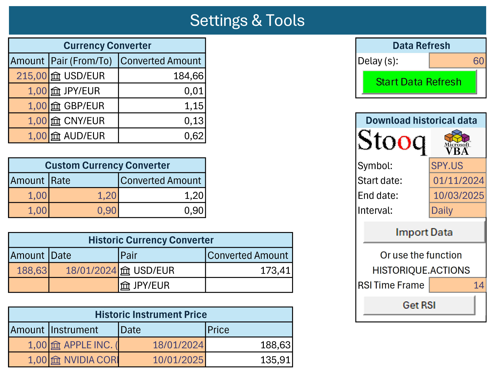
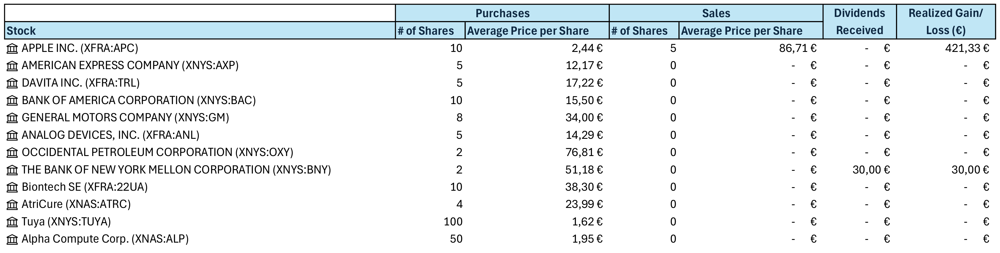

# Stock Portfolio Tracker — Excel & VBA

A multi-asset stock portfolio tracker built in Excel with a VBA automation layer, providing real-time data import, multi-currency P&L tracking, and a full analytical layer covering sector breakdown, market-cap classification, Beta, RSI, and probability-of-loss estimates. Built with no external software or paid data provider.

---

## Screenshots

<p align="center"><sub>Dashboard — Portfolio Summary &amp; Detailed Portfolio</sub></p>


<table>
  <tr>
    <td width="50%" align="center"><sub>RSI — chart &amp; conditional formatting (RSICalculationModule)</sub><br/></td>
    <td width="50%" align="center"><sub>Transactions — trade log</sub><br/></td>
  </tr>
  <tr>
    <td width="50%" align="center"><sub>Settings &amp; Tools — currency converter &amp; VBA buttons</sub><br/></td>
    <td width="50%" align="center"><sub>Realized P&amp;L — closed positions &amp; dividends</sub><br/></td>
  </tr>
</table>

---

## Features

### Data layer
- **Real-time price import** via Excel's built-in Finance API — stock quotes, sector, market cap, Beta, 12-month sparklines
- **Stooq historical data import** (`ImportDataFromStooqModule`) — downloads OHLCV data for any ticker and timeframe directly from Stooq via `MSXML2.XMLHTTP`, saves to a Windows temp file, and imports into a new sheet via `QueryTables`
- **Scheduled automatic refresh** (`DataRefreshModule`) — uses `Application.OnTime` to trigger `ThisWorkbook.RefreshAll` on a user-defined interval (in seconds) read from the named cell `RefreshInterval` in `Settings & Tools`; the cycle can be started and stopped via buttons
- **Multi-currency support** — a currency converter (spot and historic) in `Settings & Tools` converts foreign dividends and prices to euros; all user inputs are entered in euros

### Analytical layer
- **Portfolio overview** — current price, purchase price, individual and sector-level returns, daily return, sector weights, Beta, 12-month sparklines
- **Market-cap breakdown** — Nano / Small / Mid / Large / Mega Cap classification
- **S&P 500 benchmark** — tracked alongside the portfolio for direct performance comparison
- **Realized P&L** — dedicated sheet summarising gains and losses on closed positions, including dividends
- **RSI on demand** (`RSICalculationModule`) — chains the Stooq import, then computes RSI step by step: daily change → gain/loss → rolling average gain/loss over a user-defined period (`RSITimeFrame` named cell) → RS → RSI = 100 − 100 / (1 + RS). Adds conditional formatting (green > 70 overbought, red < 30 oversold, yellow neutral) and generates an RSI chart with a linear trendline
- **Dashboard** — two sections: *Portfolio Summary* (KPIs: total market value, today's change, realized and unrealized P&L; industry allocation bar chart, ticker allocation pie chart, market-cap pie chart, instrument allocation pie chart, portfolio value evolution line chart) and *Detailed Portfolio* (full position table — prices, returns, Beta, 12-month sparklines, sector weights)

### Workbook structure

| Sheet | Role |
|---|---|
| `Dashboard` | *Portfolio Summary* (KPIs + charts) and *Detailed Portfolio* (full position table) |
| `Realized P&L` | Closed positions and dividend history |
| `Transactions` | Trade log — buys, sells, dividends |
| `Settings & Tools` | Currency converter (spot + historic), refresh interval, VBA buttons |
| `Helper Sheet` | Intermediate data for chart ranges |
| `Documentation` | Usage guide, colour code, known issues |

**Colour convention:** grey cells are locked (formula-driven), orange cells accept user input, blue/white cells have no particular constraint.

### VBA modules

| Module | Role |
|---|---|
| [`DataRefreshModule.bas`](vba/DataRefreshModule.bas) | Scheduled auto-refresh via `Application.OnTime` |
| [`ImportDataFromStooq.bas`](vba/ImportDataFromStooq.bas) | HTTP download from Stooq, CSV import via `QueryTables` |
| [`RSICalculationModule.bas`](vba/RSICalculationModule.bas) | RSI computation, conditional formatting, chart generation |

---

## How to use

1. Open `PortfolioTracker.xlsm` in Excel (Windows desktop — VBA macros require the desktop application)
2. Enable macros when prompted
3. Enter your positions in the `Transactions` sheet (orange cells)
4. For dividends or transactions in foreign currency, use the currency converter in `Settings & Tools` first
5. Use the VBA buttons in `Settings & Tools` to start/stop the automatic refresh, import historical data from Stooq, or compute RSI for a given ticker and timeframe

**Requirements:** Microsoft Excel desktop (Windows), macros enabled. No external libraries, add-ins, or API keys required.

---

## Engineering decisions

**Why VBA over Power Query or external tools?**
The project required demonstrating end-to-end Excel mastery. VBA was the appropriate tool to automate data refresh, implement the Stooq HTTP download, and compute RSI natively — operations that Excel functions alone cannot express. The modules are decomposed into single-responsibility functions (`BuildUrl`, `DownloadCsv`, `ValidateInterval`, `OptimizePerformance`, etc.) for maintainability.

**Why `Application.OnTime` for the refresh cycle?**
It integrates natively with Excel's event loop without requiring a background thread or external scheduler. The interval is read from a named cell rather than hardcoded, making it configurable without touching the VBA code.

**Why Stooq for historical data?**
Stooq provides free OHLCV data via a simple CSV URL pattern (`https://stooq.com/q/d/l/?s=...`) requiring no API key. The downside is that the returned decimal separator varies by locale, requiring a `.` → `,` replacement step before numeric parsing.

**Why always input in euros?**
The Finance API returns prices in the listing currency (USD for NYSE/NASDAQ). Keeping all user inputs in euros and converting only API-sourced data avoids double-conversion errors and keeps P&L aggregation consistent.

---

## Limitations

- **Chart data ranges are static** — adding new positions requires manually extending chart series; dynamic named ranges were considered but would further bloat an already large name manager
- **Portfolio value time series is approximate** — the Finance API returns prices in varying formats depending on the listing exchange; a clean historic valuation in euros would require historic exchange rates, which would significantly slow down the workbook
- **Metrics to add** — Sharpe ratio and additional risk indicators in the *Detailed Portfolio* section were planned but not implemented within the project timeline

---

## Project structure

```
.
├── README.md
├── .gitignore
├── PortfolioTracker.xlsm        # Main workbook — all sheets and VBA modules
├── vba/
│   ├── DataRefreshModule.bas    # Scheduled auto-refresh
│   ├── ImportDataFromStooq.bas  # Stooq HTTP import
│   └── RSICalculationModule.bas # RSI computation and charting
└── screenshots/
    ├── Dashboard.png            # Dashboard — Portfolio Summary + Detailed Portfolio
    ├── RSI.png                  # RSI chart with conditional formatting
    ├── Transactions.png         # Trade log sheet
    ├── Settings_Tools.png       # Currency converter + VBA buttons
    └── Realized_PnL.png         # Closed positions and dividends
```

---

*Excel & VBA — Antoine C. · Noah D.-G. · Jules D. | Grade: 20/20 | S4, Université Catholique de Lille*
